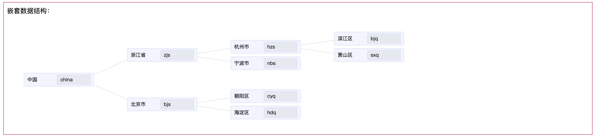
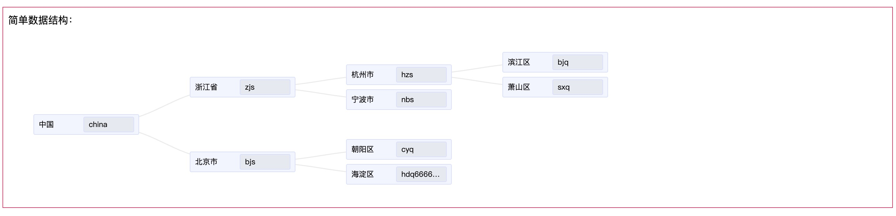
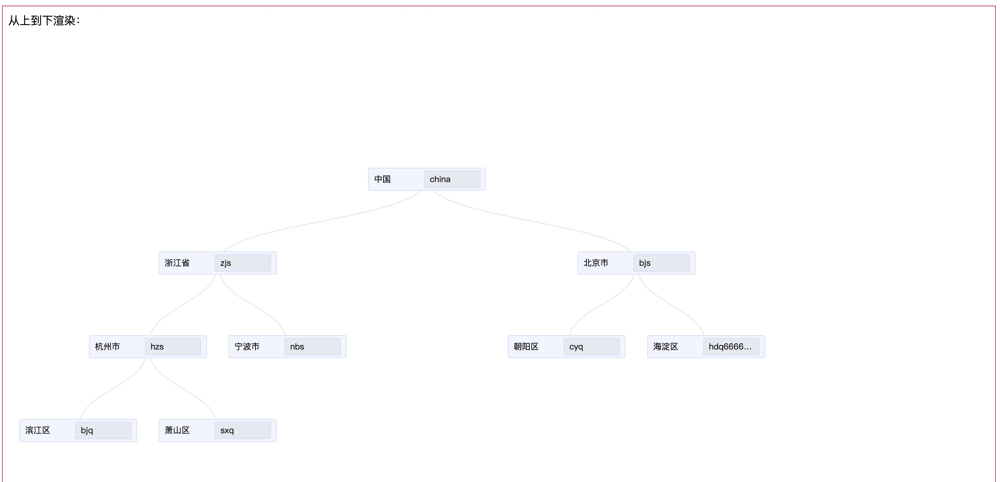
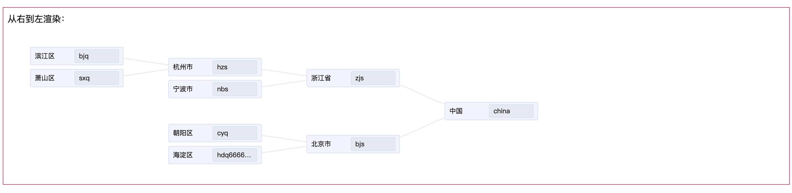
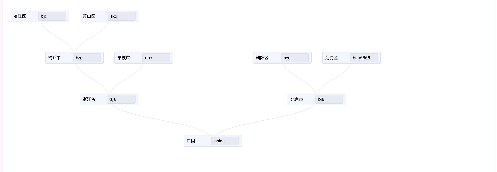
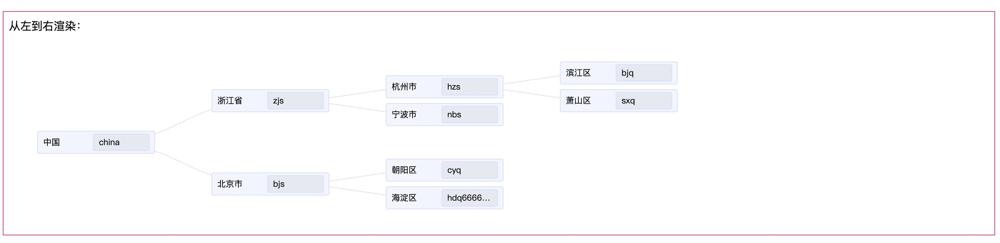

# d3-tree-chart-demo

### 1、效果图：

- 1.1、嵌套数据结构：



- 1.2、简单数据结构：



- 1.3、从上向下渲染：



- 1.4、从右向左渲染：



- 1.5、从下向上渲染：



- 1.6、从左向右渲染：



### 项目运行

##### 安装依赖

```
npm install
```

运行开发环境

```
npm run serve
```

构建成果物

```
npm run build
```